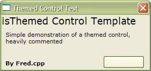



## Use the REAL theme drawing on all your controls\! \(how to use UxTheme\.dll\)

### Description

Lot of controls have Imited XP controls with images or code drawing, This is a small template that will show you how to give your usercontrols XP look, Using the real theme data. Heavily commented and easy to understand, this example only draws a command Button With 2 states: Normal and pressed, that's to make the code easy, but you can easily extend this functionality to more states like hover, defaulted, etc. includes names and ID's for all classes, parts and states for the windows controls. Comments, votes, suggestions, requests are wellcome.

Regards. - Fred.cpp
 
### More Info
 

             |
---                |---
**Submitted On**   |2004-07-15 18:44:36
**By**             |[Fred\.cpp](https://github.com/Planet-Source-Code/PSCIndex/blob/master/ByAuthor/fred-cpp.md)
**Level**          |Beginner
**User Rating**    |4.2 (25 globes from 6 users)
**Compatibility**  |VB 5\.0, VB 6\.0
**Category**       |[Custom Controls/ Forms/  Menus](https://github.com/Planet-Source-Code/PSCIndex/blob/master/ByCategory/custom-controls-forms-menus__1-4.md)
**World**          |[Visual Basic](https://github.com/Planet-Source-Code/PSCIndex/blob/master/ByWorld/visual-basic.md)
**Archive File**   |[Use\_the\_RE1770277162004\.zip](https://github.com/Planet-Source-Code/fred-cpp-use-the-real-theme-drawing-on-all-your-controls-how-to-use-uxtheme-dll__1-54973/archive/master.zip)

### API Declarations

many

